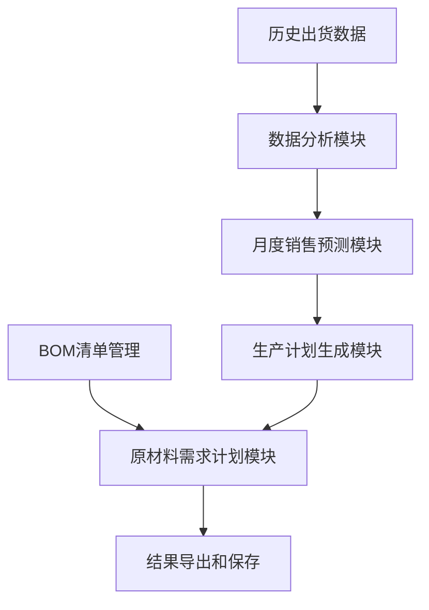

# 生产需求系统设计方案

## 1. 系统概述

本系统旨在基于历史出货数据，生成月度销售预测、生产计划和原材料需求计划。系统将使用Streamlit构建交互式应用程序界面，允许用户上传数据、调整预测参数、查看可视化结果，并将所有结果保存到本地电脑中。

### 1.1 系统目标

- 基于历史出货数据生成月度销售预测
- 根据销售预测制定生产计划
- 结合BOM清单和生产计划生成原材料需求计划
- 提供交互式界面调整和优化各项计划
- 实现数据可视化展示
- 支持结果导出和本地保存

### 1.2 系统流程图



## 2. 系统架构设计

### 2.1 目录结构

```
production_planning_system/
├── app.py                  # 主应用程序入口
├── requirements.txt        # 项目依赖
├── README.md              # 项目说明
├── data/                  # 数据文件夹
│   ├── samples/           # 示例数据
│   └── user_uploads/      # 用户上传数据
├── models/                # 业务逻辑模块
│   ├── data_processor.py  # 数据处理模块
│   ├── forecaster.py      # 预测算法模块
│   ├── production_planner.py # 生产计划模块
│   ├── bom_manager.py     # BOM管理模块
│   └── mrp_calculator.py  # MRP计算模块
├── utils/                 # 工具函数
│   ├── file_handler.py    # 文件处理
│   ├── data_validator.py  # 数据验证
│   └── visualizer.py      # 数据可视化
└── pages/                 # Streamlit多页面结构
    ├── 01_数据上传与分析.py
    ├── 02_销售预测.py
    ├── 03_生产计划.py
    ├── 04_物料清单管理.py
    └── 05_原材料需求计划.py
```

### 2.2 技术栈

- **前端框架**：Streamlit
- **数据处理**：Pandas, NumPy
- **预测算法**：Prophet, StatsModels (时间序列分析)
- **优化求解器**：Google OR-Tools
- **数据可视化**：Matplotlib, Plotly
- **文件处理**：Openpyxl, XlsxWriter

## 3. 模块详细设计

### 3.1 历史出货数据分析模块

#### 3.1.1 数据结构

历史出货数据预期结构：

| 日期 | 产品编号 | 产品名称 | 出货数量 | 客户 | 地区 | 其他属性... |
|------|----------|----------|----------|------|------|-------------|

#### 3.1.2 功能设计

- 数据导入：支持Excel/CSV格式导入
- 数据清洗：处理缺失值、异常值
- 数据聚合：按月份、产品分类汇总
- 趋势分析：计算历史增长率、季节性因素
- 数据可视化：展示历史出货量趋势图

### 3.2 月度销售预测模块

#### 3.2.1 数据结构

预测结果结构：

| 年份 | 月份 | 产品编号 | 产品名称 | 预测数量 | 预测上限 | 预测下限 | 可信度 |
|------|------|----------|----------|----------|----------|----------|--------|

#### 3.2.2 预测方法

1. **时间序列分解法**：将历史数据分解为趋势、季节性和残差
2. **移动平均法**：使用加权移动平均计算预测值
3. **指数平滑法**：对近期数据赋予更高权重
4. **ARIMA模型**：对有明显趋势和季节性的数据进行建模
5. **机器学习方法**：支持回归、Prophet等高级预测

#### 3.2.3 功能设计

- 多种预测算法选择
- 预测参数调整界面
- 预测结果可视化
- 预测准确度评估指标
- 手动调整预测值的交互功能

### 3.3 生产计划生成模块

#### 3.3.1 数据结构

生产计划结构：

| 年份 | 月份 | 产品编号 | 产品名称 | 计划生产数量 | 库存数量 | 生产提前期 | 生产批次 |
|------|------|----------|----------|--------------|----------|------------|----------|

#### 3.3.2 功能设计

- 基于预测生成初始生产计划
- 考虑现有库存水平
- 使用OR-Tools求解生产优化问题：
  - 生产能力约束
  - 最小生产批量约束
  - 生产线切换成本最小化
  - 库存持有成本与生产成本平衡
- 提供多种优化目标选择：
  - 生产成本最小化
  - 生产平滑最大化
  - 库存水平最优化
- 支持手动调整生产计划和重新优化

### 3.4 物料清单(BOM)管理模块

#### 3.4.1 数据结构

BOM基本结构：

| 产品编号 | 产品名称 | 原材料编号 | 原材料名称 | 单位用量 | 损耗率 | 供应商 | 采购提前期 |
|----------|----------|------------|------------|----------|--------|--------|------------|

#### 3.4.2 功能设计

- BOM导入与管理
- 多级BOM支持
- BOM版本控制
- 替代料管理
- BOM数据验证

### 3.5 原材料需求计划(MRP)模块

#### 3.5.1 数据结构

MRP结构：

| 年份 | 月份 | 原材料编号 | 原材料名称 | 总需求量 | 现有库存 | 净需求量 | 计划订单 | 供应商 | 预计成本 |
|------|------|------------|------------|----------|----------|----------|----------|--------|----------|

#### 3.5.2 功能设计

- 基于生产计划和BOM计算原材料需求
- 考虑现有原材料库存
- 使用OR-Tools优化原材料采购计划：
  - 考虑采购批量和提前期约束
  - 多供应商选择优化
  - 库存持有成本与采购成本平衡
  - 材料共用关系优化
- 订单时间和数量的最优化
- 成本核算功能
- 供应商分配和订单合并功能

## 4. Streamlit应用设计

### 4.1 主界面

主界面将提供导航栏，用户可以在不同功能模块之间切换。

### 4.2 数据上传与分析页面

- 文件上传组件
- 数据预览表格
- 数据验证反馈
- 数据汇总统计
- 历史趋势图表

### 4.3 销售预测页面

- 预测参数设置
- 预测算法选择
- 预测结果表格
- 预测趋势图
- 预测准确度指标
- 手动调整界面

### 4.4 生产计划页面

- 生产参数设置
- 生产计划表格
- 生产负载图
- 产能利用率分析
- 计划调整界面

### 4.5 物料清单管理页面

- BOM上传组件
- BOM数据表格
- BOM结构可视化
- BOM修改界面

### 4.6 原材料需求计划页面

- MRP参数设置
- 原材料需求表格
- 物料需求趋势图
- 采购订单生成
- 成本分析

## 5. 数据保存与导出

### 5.1 保存机制

- 通过Streamlit的下载组件提供文件导出功能
- 支持保存为Excel、CSV等格式
- 提供批量导出选项

### 5.2 导出格式

- Excel文件：包含多个工作表，分别存储预测、生产计划和MRP结果
- CSV文件：每种结果单独导出
- PDF报表：生成可打印的摘要报告

## 6. 实现计划

### 6.1 开发阶段

1. **初始开发**：
   - 核心数据处理功能
   - 基础预测算法
   - Streamlit框架搭建

2. **功能扩展**：
   - 高级预测算法
   - 生产计划优化
   - 高级可视化

3. **系统集成**：
   - 模块间数据流整合
   - 用户界面优化
   - 性能调优

### 6.2 技术挑战与解决方案

1. **大数据处理**：
   - 采用分块处理
   - 实现数据缓存机制

2. **预测准确性**：
   - 多算法融合
   - 定期模型重训练

3. **用户体验**：
   - 异步数据处理
   - 交互式界面设计
   - 操作指导提示

## 7. 系统示例数据

为了便于测试和演示，系统将提供以下示例数据：

1. 历史出货数据示例
2. BOM清单示例
3. 库存数据示例

## 8. 使用流程说明

1. 上传或使用示例历史出货数据
2. 运行数据分析和预测
3. 调整并确认销售预测
4. 生成并优化生产计划
5. 上传或选择BOM清单
6. 生成原材料需求计划
7. 查看可视化结果和报表
8. 导出保存所需文件

## 9. 后续扩展可能性

1. 添加多种预测算法选择
2. 集成供应商管理功能
3. 添加生产调度详细规划
4. 增加成本分析和优化
5. 开发报表定制功能
6. 添加数据同步备份功能