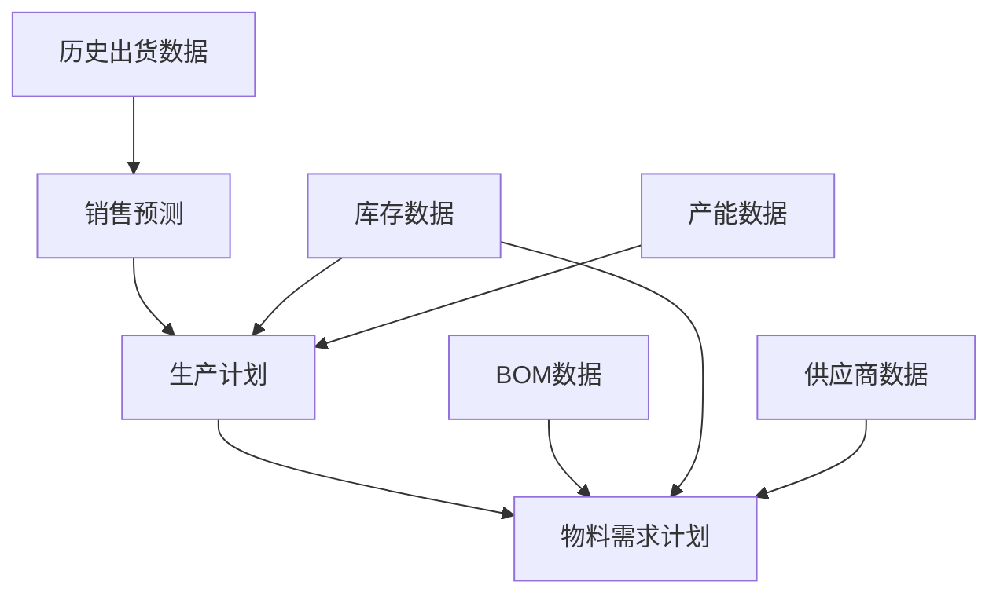

# 预测与计划输出模板

本文档展示系统生成的三种主要输出：月度销售预测、生产计划和原材料需求计划(MRP)的标准格式。

## 1. 月度销售预测输出

### 基本格式

| 年份 | 月份 | 物料编号 | 物料描述 | 预测数量 | 预测上限 | 预测下限 | 预测算法 | 可信度 | 季节性系数 | 趋势系数 |
|------|------|----------|----------|----------|----------|----------|----------|--------|------------|----------|
| 2025 | 1    | M001     | 电子元件A | 1,850    | 2,035    | 1,665    | ARIMA    | 85%    | 1.1        | 1.05     |
| 2025 | 1    | M002     | 电子元件B | 1,200    | 1,320    | 1,080    | Prophet  | 90%    | 1.0        | 1.08     |
| 2025 | 1    | M003     | 电子组件C | 600      | 720      | 480      | 指数平滑  | 80%    | 1.2        | 1.03     |
| 2025 | 2    | M001     | 电子元件A | 1,900    | 2,090    | 1,710    | ARIMA    | 82%    | 1.0        | 1.05     |
| 2025 | 2    | M002     | 电子元件B | 1,250    | 1,375    | 1,125    | Prophet  | 88%    | 1.05       | 1.08     |
| 2025 | 2    | M003     | 电子组件C | 580      | 696      | 464      | 指数平滑  | 82%    | 0.9        | 1.03     |
| ...  | ...  | ...      | ...      | ...      | ...      | ...      | ...      | ...    | ...        | ...      |

### 字段说明

1. **年份/月份**：预测期间
2. **物料编号/描述**：产品标识和名称
3. **预测数量**：预测的销售量
4. **预测上/下限**：95%置信区间的上下限
5. **预测算法**：使用的预测方法
6. **可信度**：预测结果的可信程度
7. **季节性系数**：反映季节性影响的比例
8. **趋势系数**：反映长期趋势的比例

### 预测方法说明

系统支持多种预测算法，并会为每种产品自动选择最适合的算法：

1. **ARIMA模型**：适合有明显趋势和季节性的产品
2. **Prophet**：处理有多种季节性和假日效应的产品
3. **指数平滑法**：适合短期预测和数据较少的产品
4. **移动平均法**：适合稳定型产品
5. **机器学习方法**：处理有多种影响因素的复杂情况

## 2. 生产计划输出

### 基本格式

| 年份 | 月份 | 物料编号 | 物料描述 | 预测需求 | 计划产量 | 期初库存 | 期末库存 | 产能利用率 | 标准批量 | 批次数 | 优化目标 | 优化结果 |
|------|------|----------|----------|----------|----------|----------|----------|------------|----------|--------|----------|----------|
| 2025 | 1    | M001     | 电子元件A | 1,850    | 2,000    | 300      | 450      | 85%        | 500      | 4      | 成本最小  | 最优     |
| 2025 | 1    | M002     | 电子元件B | 1,200    | 1,500    | 150      | 450      | 75%        | 500      | 3      | 成本最小  | 最优     |
| 2025 | 1    | M003     | 电子组件C | 600      | 500      | 200      | 100      | 65%        | 250      | 2      | 成本最小  | 次优     |
| 2025 | 2    | M001     | 电子元件A | 1,900    | 1,500    | 450      | 50       | 80%        | 500      | 3      | 成本最小  | 最优     |
| 2025 | 2    | M002     | 电子元件B | 1,250    | 1,000    | 450      | 200      | 70%        | 500      | 2      | 成本最小  | 最优     |
| 2025 | 2    | M003     | 电子组件C | 580      | 750      | 100      | 270      | 72%        | 250      | 3      | 成本最小  | 最优     |
| ...  | ...  | ...      | ...      | ...      | ...      | ...      | ...      | ...        | ...      | ...    | ...      | ...      |

### 字段说明

1. **年份/月份**：生产计划期间
2. **物料编号/描述**：产品标识和名称
3. **预测需求**：销售预测数量
4. **计划产量**：优化后的计划生产量
5. **期初/期末库存**：月初/月末预计库存
6. **产能利用率**：生产线使用率
7. **标准批量/批次数**：生产批量及批次
8. **优化目标**：优化的主要目标
9. **优化结果**：OR-Tools优化求解结果

### OR-Tools优化应用

生产计划由OR-Tools求解以下优化问题：

```
最小化：总成本 = 生产成本 + 库存成本 + 缺货成本 + 产能调整成本

约束条件：
1. 产能限制：每月产量不超过最大产能
2. 库存平衡：期初库存 + 计划产量 - 预测需求 = 期末库存
3. 安全库存：期末库存需满足最低安全库存要求
4. 批量生产：产量必须是标准批量的整数倍
```

## 3. 原材料需求计划(MRP)输出

### 基本格式

| 年份 | 月份 | 物料编号 | 物料描述 | 物料类型 | 毛需求量 | 期初库存 | 净需求量 | 计划订单量 | 标准包装量 | 供应商 | 采购提前期 | 订单下达日期 | 预计到货日期 | 估计成本 |
|------|------|----------|----------|----------|----------|----------|----------|------------|------------|--------|------------|--------------|--------------|----------|
| 2025 | 1    | R001     | 电阻     | 原材料   | 10,400   | 2,000    | 8,400    | 10,000     | 5,000      | SUP001 | 15         | 2024-12-17   | 2025-01-01   | 500.00   |
| 2025 | 1    | C001     | 电容     | 原材料   | 6,240    | 1,500    | 4,740    | 5,000      | 2,500      | SUP002 | 20         | 2024-12-12   | 2025-01-01   | 500.00   |
| 2025 | 1    | PCB001   | 电路板   | 原材料   | 2,080    | 300      | 1,780    | 2,000      | 100        | SUP003 | 30         | 2024-12-02   | 2025-01-01   | 10000.00 |
| 2025 | 2    | R001     | 电阻     | 原材料   | 8,900    | 1,600    | 7,300    | 10,000     | 5,000      | SUP001 | 15         | 2025-01-17   | 2025-02-01   | 500.00   |
| 2025 | 2    | C001     | 电容     | 原材料   | 5,340    | 760      | 4,580    | 5,000      | 2,500      | SUP002 | 20         | 2025-01-12   | 2025-02-01   | 500.00   |
| 2025 | 2    | PCB001   | 电路板   | 原材料   | 1,780    | 220      | 1,560    | 1,600      | 100        | SUP003 | 30         | 2025-01-02   | 2025-02-01   | 8000.00  |
| ...  | ...  | ...      | ...      | ...      | ...      | ...      | ...      | ...        | ...        | ...    | ...        | ...          | ...          | ...      |

### 字段说明

1. **年份/月份**：计划期间
2. **物料编号/描述**：原材料标识和名称
3. **物料类型**：原材料/半成品/成品
4. **毛需求量**：总需求量(含损耗)
5. **期初库存**：期初可用库存
6. **净需求量**：毛需求量减去库存后的实际需求
7. **计划订单量**：考虑标准包装后的订单量
8. **标准包装量**：供应商标准包装数量
9. **供应商**：计划采购的供应商
10. **采购提前期**：从下单到收货的天数
11. **订单下达日期**：计划下单日期
12. **预计到货日期**：预计材料到达日期
13. **估计成本**：预估采购成本

### OR-Tools优化应用

MRP计划使用OR-Tools求解以下优化问题：

```
最小化：总成本 = 采购成本 + 运输成本 + 库存成本

约束条件：
1. 需求满足：确保所有关键时间点的物料需求得到满足
2. 供应商能力：不超过供应商的最大供应能力
3. 最小订购量：满足供应商最小订购量要求
4. 订单合并：在可能的情况下合并订单以减少采购次数
5. 供应商分配：根据价格、质量和交期选择最优供应商组合
```

## 4. 系统集成输出

三种输出（预测、生产计划、MRP）在系统中无缝集成，形成完整的计划链：



优化过程中会考虑整体系统效果，而不仅仅是局部优化。例如，生产计划会考虑原材料供应情况，避免因原料短缺导致的生产延误。

## 5. 导出和保存格式

所有输出可以导出为以下格式：

1. **Excel文件**：适合详细分析和进一步处理
2. **CSV文件**：便于导入其他系统
3. **PDF报告**：适合打印和分享
4. **JSON格式**：便于与其他系统API集成